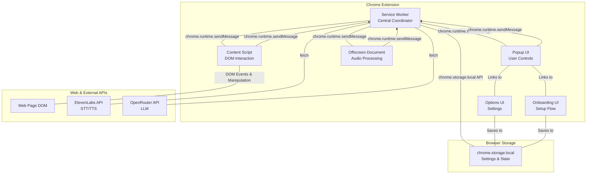
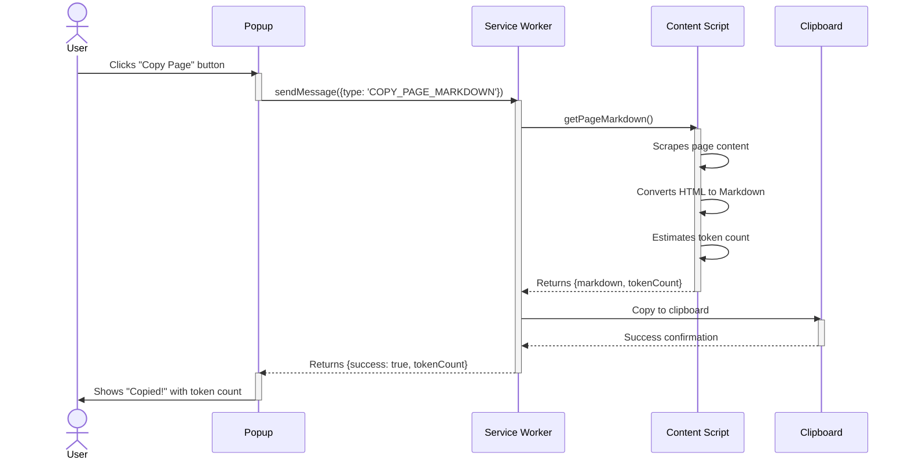

# Web Buddy Tech Demo

A voice-first AI Chrome extension that provides dictation, page copying, and conversational AI capabilities on any webpage. Built for the Pond Hackathon, July 21st, 2025.

## Features

- **Voice Dictation**: Click any text field and speak to type
- **Page Copy**: Convert any webpage to clean Markdown format
- **Web Buddy Chat**: Have a conversation with AI about the current page content
- **Site Toggle**: Enable/disable the extension per website
- **API Integration**: Uses ElevenLabs for speech-to-text/text-to-speech and OpenRouter for LLM

## Architecture Overview

The Web Buddy extension follows a **hub-and-spoke architecture** with the Service Worker acting as the central coordinator. All components communicate through the Service Worker, which manages state, orchestrates actions, and handles external API calls.



## Key Components

### Service Worker (`service-worker.js`)
The central "brain" of the extension that:
- Manages recording and analysis state
- Orchestrates communication between all components
- Handles all external API calls (ElevenLabs, OpenRouter)
- Manages the offscreen document lifecycle
- Processes audio data and coordinates TTS playback

### Content Script (`content-script.js`)
The "hands and eyes" on the webpage that:
- Injects microphone buttons into editable fields
- Handles DOM manipulation and text insertion
- Scrapes page content for analysis
- Manages clipboard operations
- Provides visual feedback during recording/processing

### Offscreen Document (`offscreen.js`)
A specialized document required by Manifest V3 that:
- Accesses `navigator.mediaDevices.getUserMedia` for microphone
- Handles audio recording via MediaRecorder API
- Manages audio playback for TTS responses
- Provides audio feedback (beeps) for user interactions

### Popup UI (`popup.js`)
The main user interface that:
- Provides primary controls (Copy Page, Web Buddy)
- Shows current status and feedback
- Manages per-site enable/disable toggle
- Links to options and onboarding

### Options UI (`options.js`)
Settings management that:
- Stores API keys and configuration
- Manages user preferences
- Provides persistent storage via `chrome.storage.local`

### Onboarding UI (`onboarding.js`)
First-time setup flow that:
- Guides users through initial configuration
- Requests microphone permissions
- Collects initial API keys
- Provides step-by-step setup experience

## Core Workflows

### 1. Voice Dictation Flow

The dictation feature allows users to speak into any text field on a webpage.

```mermaid
sequenceDiagram
    actor User
    participant CS as Content Script
    participant SW as Service Worker
    participant OFF as Offscreen Doc
    participant API as ElevenLabs STT API

    User->>CS: Clicks on text field
    activate CS
    CS->>User: Shows Mic Button
    deactivate CS

    User->>CS: Clicks Mic Button
    activate CS
    CS->>SW: sendMessage({type: 'start-recording'})
    deactivate CS
    activate SW
    SW->>OFF: setupOffscreenDocument()
    SW->>OFF: sendMessage({type: 'start-recording'})
    activate OFF
    OFF->>User: Requests Mic Permission (if needed)
    OFF->>OFF: Starts MediaRecorder
    OFF->>SW: sendMessage({type: 'recording-started-offscreen'})
    deactivate OFF
    SW->>CS: sendMessage({type: 'recording-started'})
    deactivate SW
    activate CS
    CS->>User: Updates Mic Icon to 'Recording'
    deactivate CS

    User->>CS: Clicks Mic Button again
    activate CS
    CS->>SW: sendMessage({type: 'stop-recording'})
    deactivate CS
    activate SW
    SW->>CS: sendMessage({type: 'processing-started'})
    activate CS
    CS->>User: Updates Mic Icon to 'Processing'
    deactivate CS
    SW->>OFF: sendMessage({type: 'stop-recording'})
    activate OFF
    OFF->>OFF: Stops MediaRecorder, gets Blob
    OFF->>SW: sendMessage({type: 'audio-blob-ready', dataUrl})
    deactivate OFF
    SW->>API: fetch(audio data)
    activate API
    API-->>SW: Returns {text: "..."}
    deactivate API
    SW->>CS: sendMessage({type: 'insert-text', text})
    deactivate SW
    activate CS
    CS->>CS: Inserts text into DOM element
    CS->>User: Updates Mic Icon to 'Idle'
    deactivate CS
```

### 2. Web Buddy Chat Flow

The most complex workflow involving page analysis, voice interaction, and AI conversation.
A user can select a character personality from the popup, which is saved to storage. When the chat is initiated, the service worker reads this preference to alter the AI's personality and voice.

```mermaid
sequenceDiagram
    actor User
    participant POP as Popup
    participant STO as chrome.storage
    participant SW as Service Worker
    participant CS as Content Script
    participant OFF as Offscreen Doc
    participant LLM as OpenRouter API
    participant TTS as ElevenLabs TTS API

    User->>POP: Selects Character Personality
    POP->>STO: Saves selected character ID

    User->>POP: Clicks "Web Buddy" button
    activate POP
    POP->>SW: sendMessage({type: 'START_ANALYSIS'})
    deactivate POP
    activate SW
    SW->>STO: Reads selected character ID
    STO-->>SW: Returns character ID
    SW->>SW: Loads character personality data
    SW->>POP: Updates UI to "Reading Page..."
    SW->>CS: getPageMarkdownForAnalysis()
    activate CS
    CS->>CS: Scrapes page, converts to Markdown
    CS-->>SW: Returns Markdown context
    deactivate CS
    SW->>SW: Stores page context & character
    SW->>POP: Updates UI to "Recording..."
    SW->>OFF: sendMessage({type: 'start-recording'})
    activate OFF
    OFF->>OFF: Starts recording user's question
    deactivate OFF
    
    User->>POP: Clicks "Stop Recording"
    activate POP
    POP->>SW: sendMessage({type: 'STOP_ANALYSIS_RECORDING'})
    deactivate POP
    SW->>POP: Updates UI to "Thinking..."
    SW->>OFF: sendMessage({type: 'stop-recording'})
    activate OFF
    OFF-->>SW: Returns audio blob of question
    deactivate OFF
    SW->>SW: Transcribes audio via ElevenLabs STT
    SW->>LLM: fetch(character prompt + page context + question) [stream]
    activate LLM
    loop Streaming Response
        LLM-->>SW: Receives text chunk
        SW->>SW: Buffers text into sentences
        opt When sentence is complete
            SW->>TTS: fetch(sentence, character voiceId)
            activate TTS
            TTS-->>SW: Returns audio blob for sentence
            deactivate TTS
            SW->>OFF: queueAudioForPlayback(audioBlob)
            activate OFF
            OFF->>User: Plays audio sentence
            deactivate OFF
        end
    end
    deactivate LLM
    SW->>POP: Updates UI to idle state
    deactivate SW
```

### 3. Page Copy Flow

Converts the current webpage to clean Markdown format.



## Technical Implementation Details

### Manifest V3 Architecture
- **Service Worker**: Non-persistent background script
- **Content Scripts**: Isolated world execution
- **Offscreen Document**: Required for audio APIs
- **Web Accessible Resources**: Icons and bundled libraries

### External Dependencies
- **ElevenLabs API**: Speech-to-text and text-to-speech
- **OpenRouter API**: Large language model access
- **Bundled Libraries**: Turndown (HTML→Markdown), Readability (content extraction), Tiktoken (token counting)

### State Management
- **Recording State**: Tracks dictation sessions
- **Analysis State**: Manages Web Buddy conversation flow
- **Storage**: Persistent settings via `chrome.storage.local`

### Audio Processing
- **Recording**: MediaRecorder API in offscreen document
- **Playback**: Audio API for TTS responses
- **Streaming**: Real-time audio processing for conversations

## Installation & Setup

1. Clone the repository
2. Run `npm install` to install dependencies
3. Run `npm run build` to bundle libraries
4. Load the extension in Chrome via `chrome://extensions/`
5. Complete the onboarding flow to configure API keys

## Configuration

### Required API Keys
- **ElevenLabs API Key**: For speech-to-text and text-to-speech
- **OpenRouter API Key**: For large language model access

### Optional Settings
- **OpenRouter Model**: Defaults to `google/gemma-3n-e4b-it:free`
- **ElevenLabs Voice ID**: Defaults to `1SM7GgM6IMuvQlz2BwM3`

## Development

### Project Structure
```
tts-web-buddy-tech-demo/
├── manifest.json          # Extension manifest
├── service-worker.js      # Central coordinator
├── content-script.js      # DOM interaction
├── popup.js              # User interface
├── offscreen.js          # Audio processing
├── options.js            # Settings management
├── onboarding.js         # Setup flow
├── src/
│   ├── characters.js       # Web Buddy personality definitions
│   └── libs-bundle.js    # Bundled dependencies
├── webpack.config.js     # Build configuration
└── icons/                # Extension icons
```

### Build Process
The `webpack.config.js` bundles third-party libraries into `dist/libs-bundle.js` for efficient use within the content script. The build.sh script assembles all necessary files into the build/ directory for testing.

### Key Design Patterns
- **Message Passing**: All communication via `chrome.runtime.sendMessage`
- **State Management**: Centralized in service worker
- **Error Handling**: Graceful degradation with user feedback
- **Permission Management**: Progressive enhancement

## Contributing

This is a tech demo created for the Pond Hackathon. The architecture is designed to be extensible and well-documented for future development.

## License

Created for the Pond Hackathon, July 21st, 2025.

