# Web Buddy Tech Demo

A voice-first AI Chrome extension that provides dictation, page copying, and conversational AI capabilities on any webpage. Built for the Pond Hackathon, July 21st, 2025.

## Features

- **Voice Dictation**: Click any text field and speak to type
- **Page Copy**: Convert any webpage to clean Markdown format
- **Web Buddy Chat**: Have a conversation with AI about the current page content
- **Character Personalities**: Multiple AI personalities with different voices and communication styles
- **Smart Greetings**: Random personalized greetings when starting Web Buddy to provide audio feedback
- **Site Toggle**: Enable/disable the extension per website
- **API Integration**: Uses ElevenLabs for speech-to-text/text-to-speech and Google for LLM

## Architecture Overview

Web Buddy supports various ElevenLabs TTS models, each optimized for different use cases. The model can be configured per character in the `web_buddy_params` table.

## Communication Flow Diagrams

### Web Buddy Streaming Architecture


### Real-time Streaming Flow


### Model Selection Flow


### Concurrent Processing Architecture


### Model Performance Comparison Flow

```mermaid
graph LR
    subgraph "Request Types"
        RT[Real-time Chat]
        HQ[High Quality]
        ML[Multilingual]
    end
    
    subgraph "Model Selection"
        FLASH[eleven_flash_v2_5<br/>⚡ 100-200ms]
        TURBO[eleven_turbo_v2_5<br/>🔊 200-300ms]
        MULTI[eleven_multilingual_v2<br/>🌍 300-500ms]
    end
    
    subgraph "Use Cases"
        LIVE[Live Streaming]
        PREMIUM[Premium Content]
        GLOBAL[Global Content]
    end
    
    RT --> FLASH
    HQ --> TURBO
    ML --> MULTI
    
    FLASH --> LIVE
    TURBO --> PREMIUM
    MULTI --> GLOBAL
    
    style FLASH fill:#e8f5e8
    style TURBO fill:#fff3e0
    style MULTI fill:#f3e5f5
```



## Supported Models

### 1. **Eleven Flash v2.5** (Default)
- **Model ID**: `eleven_flash_v2_5`
- **Type**: Ultra-fast generation
- **Latency**: ~100-200ms
- **Quality**: High
- **Use Case**: Real-time streaming, instant responses
- **Best For**: Web Buddy's near real-time audio streaming

### 2. **Eleven Turbo v2.5**
- **Model ID**: `eleven_turbo_v2_5`
- **Type**: Fast generation
- **Latency**: ~200-300ms
- **Quality**: Very High
- **Use Case**: Fast responses with premium quality
- **Best For**: Characters requiring higher quality audio

### 3. **Eleven Turbo v2**
- **Model ID**: `eleven_turbo_v2`
- **Type**: Fast generation (previous version)
- **Latency**: ~250-350ms
- **Quality**: High
- **Use Case**: Legacy fast generation
- **Best For**: Backward compatibility

### 4. **Eleven Multilingual v2**
- **Model ID**: `eleven_multilingual_v2`
- **Type**: Multilingual support
- **Latency**: ~300-500ms
- **Quality**: High
- **Use Case**: Non-English content
- **Best For**: Multilingual Web Buddy characters

### 5. **Eleven Multilingual v1**
- **Model ID**: `eleven_multilingual_v1`
- **Type**: Multilingual support (legacy)
- **Latency**: ~400-600ms
- **Quality**: Good
- **Use Case**: Legacy multilingual content
- **Best For**: Backward compatibility for non-English

## Googel Cloud intergation

### Supported Models

### 6. **Google Gemma 2 9B Instruct**
- **Model ID**: `google/gemma-2-9b-it`
- **Type**: Instruction-tuned language model
- **Parameters**: 9 billion
- **Latency**: ~500-800ms
- **Context Length**: 8,192 tokens
- **Use Case**: Intelligent character responses, content summarization
- **Best For**: Real-time AI character interactions with good performance

### 7. **Google Gemma 2 27B Instruct**
- **Model ID**: `google/gemma-2-27b-it`
- **Type**: Instruction-tuned language model (large)
- **Parameters**: 27 billion
- **Latency**: ~800-1200ms
- **Context Length**: 8,192 tokens
- **Use Case**: Complex reasoning, detailed content generation
- **Best For**: High-quality AI responses where latency is less critical

## Hybrid AI + TTS Architecture

### Integration Flow
1. **Text Input** → AI Model (text enhancement/generation)
2. **AI Response** → ElevenLabs TTS Model (speech synthesis)
3. **Audio Output** → Streamed to client

### Configuration Options

#### Database Schema Extension
```sql
-- Add AI provider and model configuration
ALTER TABLE web_buddy_params 
ADD COLUMN ai_provider TEXT DEFAULT 'elevenlabs',
ADD COLUMN google_model TEXT DEFAULT NULL,
ADD COLUMN ai_system_prompt TEXT DEFAULT NULL,
ADD COLUMN ai_temperature DECIMAL(3,2) DEFAULT 0.7,
ADD COLUMN ai_max_tokens INTEGER DEFAULT 150;

-- Update character to use Google + ElevenLabs hybrid
UPDATE web_buddy_params 
SET ai_provider = 'hybrid',
    google_model = 'google/gemma-2-9b-it',
    elevenlabs_model = 'eleven_flash_v2_5',
    ai_system_prompt = 'You are a helpful AI assistant. Respond naturally and conversationally.',
    ai_temperature = 0.7,
    ai_max_tokens = 150
WHERE id = 'ai-enhanced-character';
```

### Hybrid Processing Flow


## Model Configuration

### Database Configuration
Each Web Buddy character can use different AI providers and models:

```sql
-- ElevenLabs only (traditional TTS)
UPDATE web_buddy_params 
SET ai_provider = 'elevenlabs',
    elevenlabs_model = 'eleven_flash_v2_5' 
WHERE id = 'simple-tts-character';

-- Google + ElevenLabs hybrid (AI + TTS)
UPDATE web_buddy_params 
SET ai_provider = 'hybrid',
    google_model = 'google/gemma-2-9b-it',
    elevenlabs_model = 'eleven_turbo_v2_5',
    ai_system_prompt = 'You are a knowledgeable assistant.',
    ai_temperature = 0.8,
    ai_max_tokens = 200
WHERE id = 'ai-enhanced-character';

-- View current model configurations
SELECT id, title, ai_provider, google_model, elevenlabs_model 
FROM web_buddy_params 
ORDER BY sort_order;
```

### Migration Default
All characters default to `eleven_flash_v2_5` for optimal streaming performance:

```sql
-- Set default model for all characters
ALTER TABLE web_buddy_params 
ADD COLUMN elevenlabs_model TEXT NOT NULL DEFAULT 'eleven_flash_v2_5';
```

## Performance Comparison

### Traditional TTS Models
| Model | Latency | Quality | Streaming | Use Case |
|-------|---------|---------|-----------|----------|
| `eleven_flash_v2_5` | ⚡ Fastest (100-200ms) | 🔊 High | ✅ Excellent | Real-time responses |
| `eleven_turbo_v2_5` | ⚡ Fast (200-300ms) | 🔊 Very High | ✅ Good | Premium quality |
| `eleven_turbo_v2` | ⚡ Fast (250-350ms) | 🔊 High | ✅ Good | Legacy fast |
| `eleven_multilingual_v2` | 🕐 Medium (300-500ms) | 🔊 High | ⚠️ Slower | Multi-language |
| `eleven_multilingual_v1` | 🕐 Slow (400-600ms) | 🔊 Good | ⚠️ Slow | Legacy multi-lang |

### AI + TTS Hybrid Models
| AI Model | AI Latency | Total Latency* | Intelligence | Use Case |
|----------|------------|----------------|--------------|----------|
| `google/gemma-2-9b-it` + ElevenLabs | 500-800ms | 600-1000ms | 🧠 High | Smart responses |
| `google/gemma-2-27b-it` + ElevenLabs | 800-1200ms | 900-1500ms | 🧠 Very High | Complex reasoning |

*Total latency includes AI processing + TTS generation

## Recommendations

### For Real-Time Streaming (Default)
- **Use**: `eleven_flash_v2_5`
- **Why**: Ultra-fast generation (~100-200ms) optimized for streaming
- **Perfect for**: Web Buddy's concurrent processing architecture

### For Premium Quality
- **Use**: `eleven_turbo_v2_5`
- **Why**: Best balance of speed and quality
- **Perfect for**: Characters requiring premium audio quality

### For Multilingual Content
- **Use**: `eleven_multilingual_v2`
- **Why**: Supports multiple languages with good quality
- **Perfect for**: Non-English Web Buddy characters

### For AI-Enhanced Characters
- **Use**: `google/gemma-2-9b-it` + `eleven_flash_v2_5`
- **Why**: Good balance of AI intelligence and TTS speed
- **Perfect for**: Interactive AI characters with real-time responses

### For Advanced AI Characters
- **Use**: `google/gemma-2-27b-it` + `eleven_turbo_v2_5`
- **Why**: Maximum AI capability with high-quality audio
- **Perfect for**: Complex reasoning tasks and detailed character interactions

## Character-Specific Examples

```sql
-- Ultra-fast for real-time characters
UPDATE web_buddy_params 
SET elevenlabs_model = 'eleven_flash_v2_5' 
WHERE id IN ('mood-sensitive-reader', 'vocal-navigation-companion');

-- Premium quality for detailed characters
UPDATE web_buddy_params 
SET elevenlabs_model = 'eleven_turbo_v2_5' 
WHERE id = 'humorous-parody';

-- Multilingual for international characters
UPDATE web_buddy_params 
SET elevenlabs_model = 'eleven_multilingual_v2' 
WHERE id = 'multilingual-clarity-assistant';

-- AI-enhanced characters with intelligent responses
UPDATE web_buddy_params 
SET ai_provider = 'hybrid',
    google_model = 'google/gemma-2-9b-it',
    elevenlabs_model = 'eleven_flash_v2_5',
    ai_system_prompt = 'You are a mood-sensitive reader who adapts your tone based on content.',
    ai_temperature = 0.8,
    ai_max_tokens = 200
WHERE id = 'mood-sensitive-reader';

-- Advanced AI character for complex tasks
UPDATE web_buddy_params 
SET ai_provider = 'hybrid',
    google_model = 'google/gemma-2-27b-it',
    elevenlabs_model = 'eleven_turbo_v2_5',
    ai_system_prompt = 'You are an expert consultant providing detailed analysis and insights.',
    ai_temperature = 0.6,
    ai_max_tokens = 300
WHERE id = 'expert-consultant';
```

## Technical Implementation

### ElevenLabs-Only Processing
```typescript
const elevenLabsRequest: ElevenLabsRequest = {
  text: sanitizedSentence,
  model_id: character.elevenlabs_model, // Dynamic model selection
  voice_settings: {
    stability: 0.4,
    similarity_boost: 0.7,
    style: 0.3,
    use_speaker_boost: true
  }
};
```

### Hybrid AI + TTS Processing
```typescript
// Step 1: Process with Google AI model
const openRouterRequest = {
  model: character.google_model, // e.g., 'google/gemma-2-9b-it'
  messages: [
    {
      role: 'system',
      content: character.ai_system_prompt
    },
    {
      role: 'user', 
      content: userMessage
    }
  ],
  temperature: character.ai_temperature,
  max_tokens: character.ai_max_tokens
};

const aiResponse = await fetch('https://google.ai/api/v1/chat/completions', {
  method: 'POST',
  headers: {
    'Authorization': `Bearer ${OPENROUTER_API_KEY}`,
    'Content-Type': 'application/json'
  },
  body: JSON.stringify(openRouterRequest)
});

const enhancedText = await aiResponse.json();

// Step 2: Convert AI response to speech with ElevenLabs
const elevenLabsRequest: ElevenLabsRequest = {
  text: enhancedText.choices[0].message.content,
  model_id: character.elevenlabs_model,
  voice_settings: {
    stability: 0.4,
    similarity_boost: 0.7,
    style: 0.3,
    use_speaker_boost: true
  }
};
```

### Environment Configuration
```bash
# Google Integration
OPENROUTER_API_KEY=your_google_api_key
OPENROUTER_BASE_URL=https://google.ai/api/v1

# ElevenLabs (existing)
ELEVENLABS_API_KEY=your_elevenlabs_api_key
ELEVENLABS_VOICE_ID=your_default_voice_id
```

## Model Updates

When ElevenLabs releases new models:

1. **Add to Documentation**: Update this file with new model specifications
2. **Update Database**: Add new model options to character configurations
3. **Test Performance**: Verify streaming performance and quality
4. **Update Defaults**: Consider updating default model if significantly better

## Usage Patterns & Best Practices

### Character Design Guidelines

#### Traditional TTS Characters
- **Fast Response Required**: Use `eleven_flash_v2_5`
- **High Audio Quality**: Use `eleven_turbo_v2_5`
- **Multiple Languages**: Use `eleven_multilingual_v2`

#### AI-Enhanced Characters
- **Conversational AI**: `google/gemma-2-9b-it` + `eleven_flash_v2_5`
- **Expert Analysis**: `google/gemma-2-27b-it` + `eleven_turbo_v2_5`
- **Creative Writing**: `google/gemma-2-27b-it` + `eleven_multilingual_v2`

### Cost Considerations

| Provider | Model | Cost per 1K tokens/chars | Recommended Usage |
|----------|-------|---------------------------|-------------------|
| ElevenLabs | Flash v2.5 | $0.30/1K chars | High-volume streaming |
| ElevenLabs | Turbo v2.5 | $0.30/1K chars | Premium quality |
| Google | Gemma 2 9B | $0.10/1K tokens | Cost-effective AI |
| Google | Gemma 2 27B | $0.20/1K tokens | Advanced reasoning |

## Current Status

- **Default TTS Model**: `eleven_flash_v2_5` (optimized for streaming)
- **Default AI Model**: `google/gemma-2-9b-it` (balanced performance)
- **Processing Mode**: Single text processing (no chunking/splitting)
- **Streaming Latency**: 
  - TTS Only: ~100-300ms
  - AI + TTS: ~600-1000ms
- **Quality**: High quality maintained across all supported models
- **AI Integration**: Full Google support with Google Gemma models

## Roadmap

### Planned Integrations
- **Additional AI Models**: Claude, GPT-4, Llama 2/3
- **Enhanced Streaming**: Real-time AI text streaming
- **Voice Cloning**: Custom voice training integration
- **Multilingual AI**: Cross-language AI processing

---

*Last Updated: August 2025*
*Web Buddy Version: 2.1+ (AI Integration)*